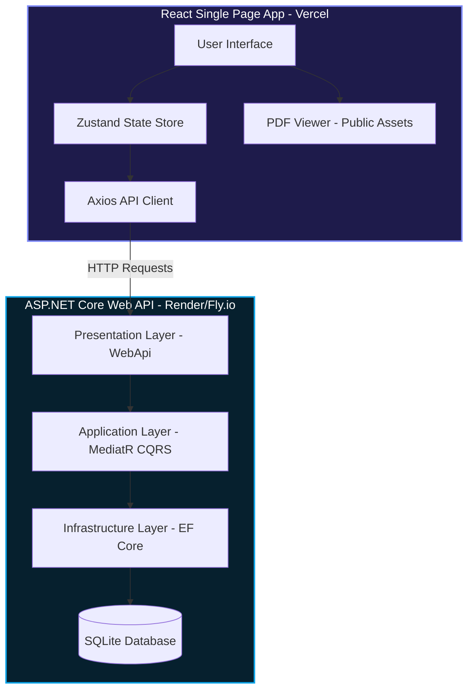

# Power BI Course Learning Portal

A premium, modern, dark-mode workspace for studying Master Analytical Thinking & Data Analysis with Power BI.

This project features:
- **Backend**: C# ASP.NET Core Web API following **Clean Architecture & SOLID principles**, running an in-memory SQLite database that automatically seeds course PDFs.
- **Frontend**: React + Vite + TypeScript Single Page Application with a **Feature-Based structure** and modern **glassmorphic design**, complete with progress tracking, PDF viewer, and debounced notes autosave.

---

## System Architecture



---

## Project Structure

- `/src`: React source files (components, store, services, types).
- `/public`: React public assets (including course PDFs in `/public/pdfs/`).
- `/backend`: C# ASP.NET Core Clean Architecture backend API.
- `/package.json`: Frontend package manager configuration.
- `/tsconfig.json`: Frontend TypeScript project configuration.
- `/vite.config.ts`: Vite build tool configuration.

---

## How to Run Locally

### Prerequisites
- .NET SDK 9.0 or 10.0
- Node.js (v18+) and npm

### Step 1: Run C# Backend API
1. Navigate to the `backend/` directory:
   ```bash
   cd backend
   ```
2. Build and run the project:
   ```bash
   dotnet run --project src/4.WebApi/PowerBILearning.WebApi.csproj
   ```
3. The API will start and listen at `http://localhost:5194`.
   *(On first run, the SQLite database `PowerBILearning.db` will be automatically created and populated with the 8 default Power BI course lectures).*

### Step 2: Run React Frontend
1. Run this command in the **root** workspace directory:
   ```bash
   npm install
   ```
2. Start the Vite dev server:
   ```bash
   npm run dev
   ```
3. Open your browser and navigate to `http://localhost:5173`.

---

## How to Deploy

### 1. Frontend (React) to Vercel
Deploying to Vercel is extremely easy and free:
1. Push this repository to **GitHub**.
2. Go to the [Vercel Dashboard](https://vercel.com/) and click **Add New > Project**.
3. Import your GitHub repository.
4. Vercel will automatically detect **Vite** at the root of your repository and configure the build command (`npm run build`) and output directory (`dist`).
5. Add an Environment Variable:
   - Name: `VITE_API_URL`
   - Value: `https://your-backend-api-url.onrender.com` (Your deployed C# API URL).
6. Click **Deploy**.

### 2. Backend (C#) to Render.com / Fly.io
To host your C# API for free, you can use Render:
1. Render will detect the `Dockerfile` inside the `backend/` directory.
2. In the Render Dashboard, click **New > Web Service**.
3. Select your repository.
4. Set the **Root Directory** setting to `backend` in the Render configuration.
5. Under build settings:
   - Set the build run command to Docker.
   - Render will build your Docker image and expose the API endpoint.
   - Configure a persistent disk if you want the SQLite file to survive deployments, or connect to a free PostgreSQL database (updating the ConnectionString in `appsettings.json` to PostgreSQL).
